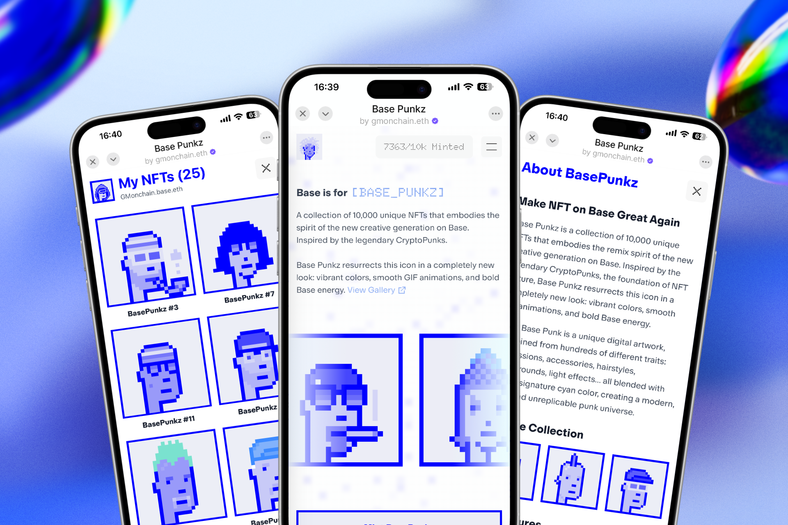

  

# Make NFT on Base Great Again

**Base Punkz: 10,000 Unique NFTs That Embody the Remix Spirit of the New Creative Generation on Base**

Base Punkz is a collection of 10,000 unique NFTs that embodies the remix spirit of the new creative generation on Base. Inspired by the legendary CryptoPunks, the foundation of NFT culture, Base Punkz resurrects this icon in a completely new look: vibrant colors, smooth GIF animations, and bold Base energy.

## Sample Collection

<table style="width:100%">
  <tr>
    <td style="width:33%; text-align:center;">
      
      
<strong>Base Punk #1</strong>

    </td>
    <td style="width:33%; text-align:center;">
      
      
<strong>Base Punk #2</strong>

    </td>
    <td style="width:33%; text-align:center;">
      
      
<strong>Base Punk #3</strong>

    </td>
  </tr>
</table>

## What is Base Punkz?

Base Punkz is a collection of 10,000 unique NFTs on the Base blockchain, inspired by the iconic CryptoPunks. Each Base Punkz features unique animated effects and Base-themed colors, making them distinctive digital collectibles.

Each Base Punk is a unique digital artwork, combined from hundreds of different traits: expressions, accessories, hairstyles, backgrounds, light effects... all blended with Base's signature cyan color, creating a modern, bold, and unreplicable punk universe.

## Key Features

### 🎨 Remixed Aesthetics
Classic CryptoPunks pixel art style combined with modern GIF animations

### ⚡ Base Energy
Each NFT carries Base DNA, cyan colors inspired by speed, scalability, and community

### 🔢 10K Uniques
No NFT is like another – each Base Punk is a distinct individual on the blockchain

### 🔒 On-chain & Immutable
Data stored permanently, transparent and authentic on Base network

## Collection Stats

| Metric | Value |
|--------|-------|
| **Total Supply** | 10,000 |
| **Blockchain** | Base |
| **Unique Traits** | 100+ |

## How to Mint Base Punkz

1. **Connect Your Wallet**: Link your Web3 wallet (like MetaMask) to the Base network
2. **Join Waitlist**: Sign up for our waitlist to get notified about the mint date
3. **Mint Date**: Wait for the official launch and mint your Base Punkz
4. **Collect & Trade**: Start building your collection and trade on supported marketplaces

## NFT Uniqueness

Each Base Punkz has a unique combination of traits including:
- **Skin tones**: Various Base-inspired colors
- **Hairstyles**: Modern and classic punk styles
- **Facial features**: Unique expressions and accessories
- **Special effects**: Animated elements and lighting
- **Backgrounds**: Dynamic and static options

Some traits are extremely rare, making certain Punkz more valuable in the collection.

## Base Network Advantages

Built on Base, Base Punkz offers:
- **Lightning-fast transactions**: Quick minting and trading
- **Ultra-low gas fees**: Cost-effective for collectors
- **Ethereum security**: Full EVM compatibility and security
- **Scalable infrastructure**: Built for mass adoption

## Trading Your Base Punkz

Once minted, you can trade your Base Punkz on NFT marketplaces that support the Base network:
- **OpenSea**: Primary marketplace with Base support
- **Blur**: Fast trading platform
- **Other DEXs**: Various decentralized exchanges

You'll have full ownership and control of your NFT with complete transparency on the blockchain.

## Frequently Asked Questions

### What blockchain is this on?
Base Punkz are built on the Base network, an Ethereum Layer 2 solution developed by Coinbase. Base offers fast, low-cost transactions while maintaining Ethereum's security.

### How many NFTs are there?
There are 10,000 Base Punkz in total. Each one is unique with randomly generated traits including different hairstyles, accessories, backgrounds, and special effects. Some traits are rarer than others.

### What makes each NFT unique?
Each Base Punkz has a unique combination of traits including skin tones, hairstyles, facial features, accessories, and special animated effects. Some traits are extremely rare, making certain Punkz more valuable.

### Can I trade my Base Punk?
Yes! Once minted, you can trade your Base Punk on NFT marketplaces that support Base network, such as OpenSea, Blur, and others. You'll have full ownership and control of your NFT.

## Join the Base Punkz Community

Be part of the revolution bringing NFT culture to Base. Collect, trade, and showcase your unique Base Punkz in this vibrant new ecosystem.